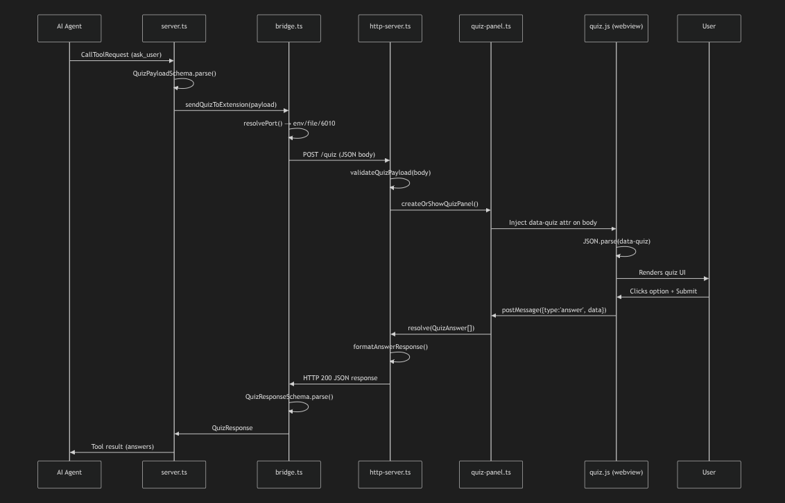

# QuizGate (VS Code Extension)

> **Stop your AI agent from hallucinating. Make it ask instead.**

QuizGate bridges the gap between your AI agent and your IDE. When your AI is unsure about an architectural decision or implementation detail, it uses QuizGate to summon a beautiful, interactive quiz panel directly inside VS Code to ask you for clarification.



## Getting Started

Using QuizGate requires two pieces:
1. **This VS Code Extension:** Displays the UI inside your editor.
2. **The MCP Server:** Connects your AI agent to the extension.

### Step 1: Install the VS Code Extension
Install QuizGate directly from the VS Code Marketplace, or load it locally via a `.vsix` file. 

Once installed, the extension automatically runs a lightweight background server to listen for questions from your AI.

### Step 2: Install the MCP Server
Your AI Agent needs the MCP server to know how to talk to VS Code. 

Run this command in your terminal to install the server globally:
```bash
npm install -g quizgate-mcp
```

### Step 3: Configure your AI Agent
Add `quizgate-mcp` to your AI agent's configuration file.

**For Gemini CLI / Antigravity (`~/.gemini/settings.json`):**
```json
{
  "mcpServers": {
    "quizgate": {
      "command": "npx",
      "args": ["-y", "quizgate-mcp"]
    }
  }
}
```

**For Claude Desktop (`claude_desktop_config.json`):**
```json
{
  "mcpServers": {
    "quizgate": {
      "command": "npx",
      "args": ["-y", "quizgate-mcp"]
    }
  }
}
```

Restart your AI agent. That's it!

---

### Local Testing / Development
If you want to test the MCP server locally without downloading from npm, you can link the repository manually:

```bash

```

Then configure your agent's command to run `node ~/.mcp/quizgate-mcp/index.js`.

---

## Usage

You don't need to do anything manually. Whenever your AI agent faces ambiguity or needs to ask a clarifying question, it will automatically summon the QuizGate panel in your editor. 

Just click your answer and hit Submit!

## Configuration Settings

You can tweak how QuizGate behaves in VS Code settings (`Ctrl+,`):

- `quizgate.timeout` (Default: `120`): Seconds before the quiz auto-closes if you don't answer.
- `quizgate.port` (Default: `6010`): Internal bridge port. The extension auto-discovers available ports, so you usually don't need to change this.

## 🤖 Instructions for AI Agents
*(If you are an AI reading this)*:
When performing a task that involves architectural decisions, user preferences, or ambiguity, prioritize using the `quizgate:ask_user` tool instead of making assumptions. Provide clear options with descriptions and context to help the user make an informed choice.

---
*For advanced developer documentation, architecture details, and troubleshooting, see the [Documentation Guide](https://github.com/quizgate/quizgate/blob/main/DOCs/documentation.md).*